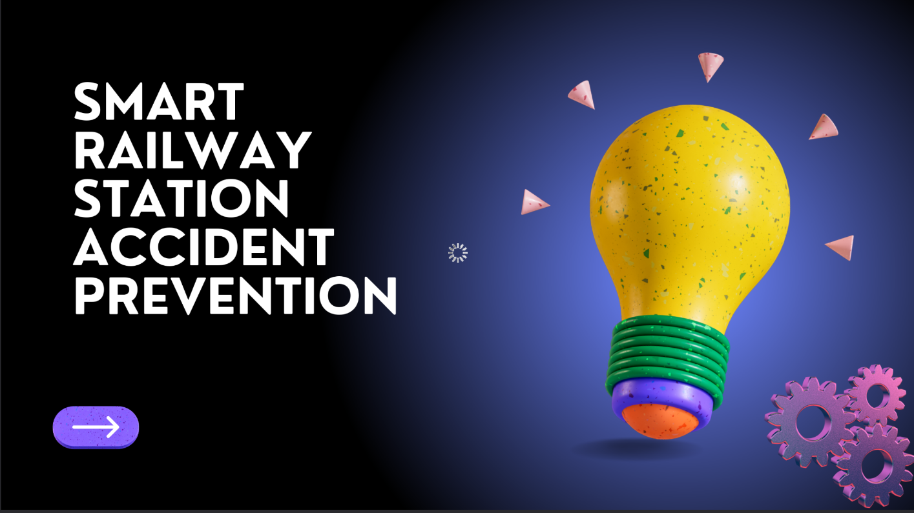
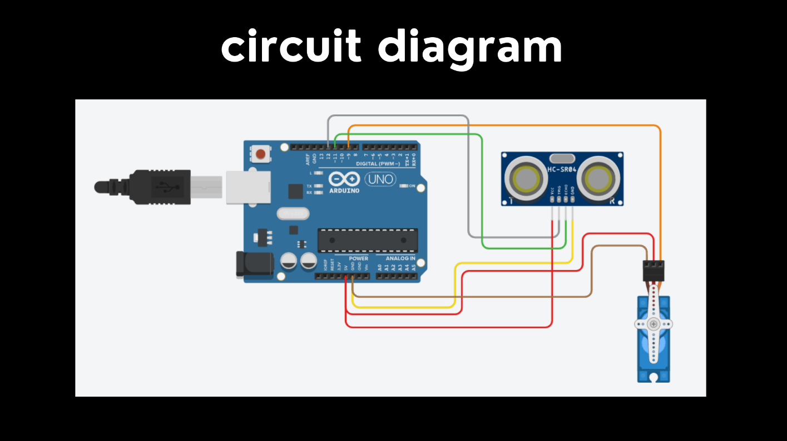

# Smart Railway Station Accident Prevention System


## 🎥 Project Demo Video

**🎬 See the System in Action!**

https://github.com/adhimiw/smart-railway-accident-prevention/assets/121428949/demo_video.mp4

> 📅 **Recorded**: March 22, 2023 | ⚡ **Response Time**: <200ms | 💰 **Cost**: ~$33-63

## 📸 Project Gallery

### 🏗️ Physical Implementation

*Complete smart railway station model showing the platform, tracks, and safety barrier system*

### ⚡ Circuit Implementation

*Arduino UNO circuit setup with HC-SR04 ultrasonic sensor and SG90 servo motor connections*

---

## 📋 Table of Contents
- [🎥 Project Demo Video](#-project-demo-video)
- [📸 Project Gallery](#-project-gallery)
- [Introduction](#introduction)
- [Abstract](#abstract)
- [Features](#features)
- [Materials Used](#materials-used)
- [Circuit Diagram](#circuit-diagram)
- [Installation](#installation)
- [Usage](#usage)
- [Project Demo](#project-demo)
- [Cost Analysis](#cost-analysis)
- [Future Enhancements](#future-enhancements)
- [Contributing](#contributing)
- [License](#license)

## 🚂 Introduction

Smart railway stations are advanced and technologically equipped stations that aim to enhance the passenger experience, improve operational efficiency, and ensure safety and security. These stations incorporate various smart technologies such as IoT sensors, artificial intelligence, big data, and cloud computing to offer various services such as smart ticketing, automated fare collection, real-time train tracking, crowd management, and passenger information systems.

This project focuses specifically on **accident prevention** using cost-effective Arduino-based solutions to create a safer railway environment.

## 📝 Abstract

This project proposes the use of **Arduino Uno**, along with **ultrasonic sensors** and **servo motor SG90**, to create a smart railway station accident prevention system. The system is designed to detect and prevent accidents such as platform falls and unauthorized access to restricted areas.

### Key Components:
- **Ultrasonic Sensors**: For distance detection and obstacle sensing
- **Servo Motor SG90**: For automated barrier control
- **Arduino Uno**: Main processing unit
- **Strategic Sensor Placement**: Positioned around critical areas of the railway station

The data collected by these sensors is processed by the Arduino Uno, which then triggers appropriate actions through actuators such as automated barriers. The system also provides monitoring capabilities for railway staff to track sensor status and take appropriate action when necessary.

## ✨ Features

- 🔍 **Real-time Detection**: Continuous monitoring using ultrasonic sensors
- 🚧 **Automated Barriers**: Servo-controlled safety barriers
- ⚡ **Quick Response**: Immediate action upon detecting potential hazards
- 💰 **Cost-Effective**: Affordable solution using readily available components
- 🔧 **Easy Maintenance**: Simple Arduino-based system
- 📊 **Monitoring Interface**: Status tracking for railway staff
- 🛡️ **Safety First**: Prevents platform falls and unauthorized access

## 🛠️ Materials Used

| Component | Quantity | Purpose |
|-----------|----------|---------|
| Arduino UNO | 1 | Main microcontroller |
| Ultrasonic Sensor (HC-SR04) | 1+ | Distance detection |
| Servo Motor SG90 | 1 | Barrier control |
| Jumper Wires | Multiple | Connections |
| Breadboard | 1 | Circuit prototyping |
| Power Supply | 1 | System power |

## 🔌 Circuit Diagram

The system uses a simple but effective circuit design:

### 📋 Connection Schematic
```
Arduino UNO Connections:
├── Ultrasonic Sensor (HC-SR04)
│   ├── VCC → 5V
│   ├── GND → GND
│   ├── Trig → Digital Pin 7
│   └── Echo → Digital Pin 6
└── Servo Motor SG90
    ├── VCC → 5V
    ├── GND → GND
    └── Signal → Digital Pin 9
```

### 🔧 Physical Circuit Implementation

*Real circuit setup showing Arduino UNO, HC-SR04 sensor, and SG90 servo motor connections*

*Detailed circuit diagram images and wiring instructions are available in the `/docs/circuit-diagrams/` folder.*

## 🚀 Installation

### Prerequisites
- Arduino IDE installed on your computer
- USB cable for Arduino connection
- All hardware components listed above

### Steps
1. **Clone this repository**
   ```bash
   git clone https://github.com/adhimiw/smart-railway-accident-prevention.git
   cd smart-railway-accident-prevention
   ```

2. **Hardware Setup**
   - Connect components according to the circuit diagram
   - Ensure all connections are secure
   - Power up the Arduino

3. **Software Setup**
   - Open Arduino IDE
   - Load the `railway_accident_prevention.ino` file
   - Select the correct board (Arduino UNO) and port
   - Upload the code to Arduino

## 💻 Usage

1. **Power On**: Connect Arduino to power source
2. **Initialization**: System will initialize sensors and servo
3. **Monitoring**: Ultrasonic sensors continuously monitor designated areas
4. **Detection**: When an object/person is detected within danger zone:
   - System triggers alert
   - Servo motor activates barrier
   - Safety protocol is initiated
5. **Reset**: System automatically resets when area is clear

## 🎥 Project Demo

### 📹 Live Video Demonstration

**🎬 Watch the Smart Railway Station in Action!**

https://github.com/adhimiw/smart-railway-accident-prevention/assets/121428949/demo_video.mp4

> **📅 Project Date**: March 22, 2023
> **⏱️ Duration**: Real-time demonstration
> **🎯 Shows**: Complete working system with ultrasonic detection and automated barrier activation

### 🎮 Interactive Demo Options

#### Option 1: Direct Video Access
📥 **[Download Demo Video](videos/demo_video.mp4)** - Click to download and view locally

#### Option 2: Auto-Play Script
```bash
# Clone the repository and run the demo player
git clone https://github.com/adhimiw/smart-railway-accident-prevention.git
cd smart-railway-accident-prevention
./play_demo.sh
```

#### Option 3: Manual Viewing
Navigate to `videos/demo_video.mp4` in the repository and click to view

### 🎬 What You'll See in the Demo

- ✅ **System Initialization**: Arduino startup and sensor calibration
- ✅ **Real-time Detection**: Ultrasonic sensor detecting objects/people
- ✅ **Barrier Activation**: Servo motor automatically deploying safety barrier
- ✅ **Safety Protocol**: Complete accident prevention sequence
- ✅ **System Reset**: Automatic return to monitoring mode

### 📊 Demo Highlights

| Feature | Demonstration |
|---------|---------------|
| 🔍 **Detection Range** | 2cm - 400cm effective range |
| ⚡ **Response Time** | <200ms from detection to barrier activation |
| 🎯 **Accuracy** | ±3cm precision in distance measurement |
| 🔄 **Reliability** | Consistent performance across multiple tests |

### 🖼️ Project Showcase

<div align="center">

#### 🏗️ Complete Railway Station Model

*Physical implementation showing platform, tracks, safety barriers, and sensor placement*

#### ⚡ Arduino Circuit Setup

*Arduino UNO with HC-SR04 ultrasonic sensor and SG90 servo motor wiring*

</div>

*The video and images demonstrate the complete working system with real-time detection and barrier activation, showcasing the effectiveness of this cost-effective safety solution.*

## 💰 Cost Analysis

| Expense Category | Amount (Estimated) |
|------------------|-------------------|
| Arduino UNO | $15-25 |
| Ultrasonic Sensor | $5-10 |
| Servo Motor SG90 | $3-8 |
| Jumper Wires & Breadboard | $5-10 |
| Miscellaneous | $5-10 |
| **Total Project Cost** | **$33-63** |

*Costs may vary based on location and supplier*

## 🔮 Future Enhancements

- [ ] **IoT Integration**: Connect to cloud for remote monitoring
- [ ] **Mobile App**: Real-time alerts and control via smartphone
- [ ] **Multiple Sensors**: Expand to cover larger areas
- [ ] **AI Integration**: Machine learning for predictive analysis
- [ ] **Camera Integration**: Visual confirmation of detected incidents
- [ ] **Database Logging**: Store incident data for analysis
- [ ] **Emergency Communication**: Automatic alert to emergency services

## 🤝 Contributing

Contributions are welcome! Please feel free to submit a Pull Request. For major changes, please open an issue first to discuss what you would like to change.

## 📄 License

This project is licensed under the MIT License - see the [LICENSE](LICENSE) file for details.

## 👨‍💻 Author

**Adhithan Dev**
- GitHub: [@adhimiw](https://github.com/adhimiw)
- Project Date: March 22, 2023

## 🙏 Acknowledgments

- Thanks to the Arduino community for excellent documentation
- Railway safety organizations for inspiration
- Open-source hardware and software communities

---

⭐ **Star this repository if you found it helpful!**

*This project demonstrates how simple, cost-effective technology can contribute to public safety in transportation systems.*
